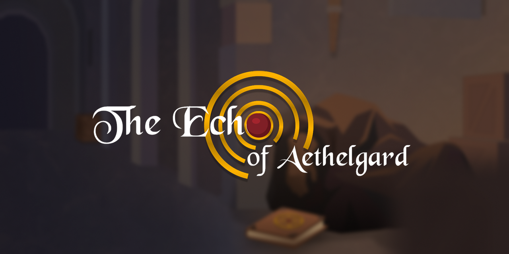
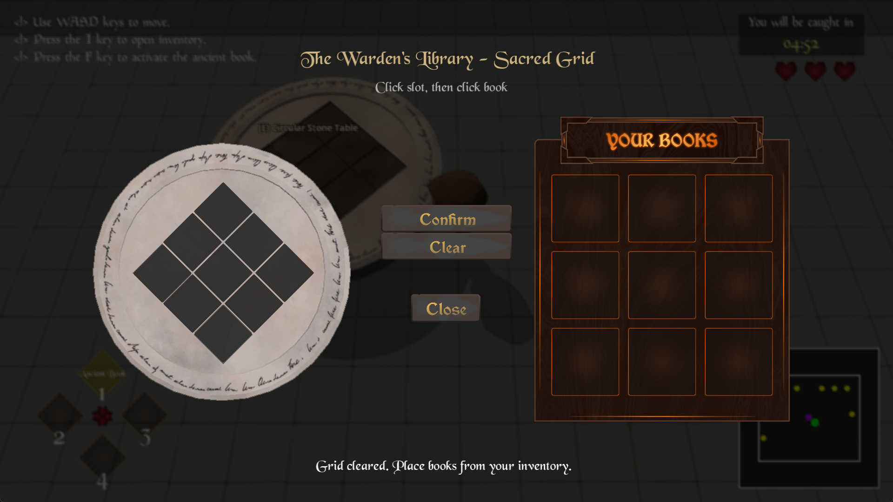
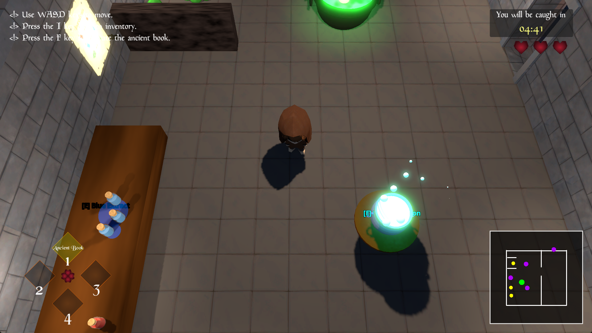

# 📖 The Echo of Aethelgard

  

  
  
  

  <b><i>"Your death is already written. Will you read the spoiler, or dare to rewrite the end?"</i></b>

  

## 📍 Quick Navigation
* [📖 The Lore](#-the-forbidden-archives)
* [🎮 Download & Play](#-download--play)
* [✨ Key Features](#-key-features)
* [⌨️ Controls](#-controls)
* [👥 The Architects](#-the-architects-credits)

  

## 📜 The Forbidden Archives
> [!IMPORTANT]
> **MESSAGE FROM THE GRIMOIRE:** > *"I have seen you reading this. Spoiler: You are already considering clicking that download link. Your curiosity is your greatest weapon... or your downfall."*

  
<b>Click to reveal the Story of Ironfang Prison...</b>

   
  You awake in the cold, damp cells of Ironfang, a prisoner of King Valerius. The air is thick with the scent of old stone and the whispers of those who failed before you. 
  
  But you are not alone. By your side lies the <b>Glimpse Grimoire</b>—an ancient, sentient book that knows exactly how you are going to die. To escape, you must embrace the spoilers of your own fate.

  

## 🎮 Download & Play
The pre-compiled `.exe` version for Windows is available for download via the links below:

  
  

> [!NOTE]
> **System Requirements:** Windows 10/11, .NET 8.0 Runtime, and a GPU compatible with Vulkan/Forward+.

  

## ✨ Key Features
* 👁️ **The Glimpse Mechanic:** Peer into the future to reveal hidden solutions and deadly spoilers.

  

* 🏰 **Atmospheric 3D Low-Poly:** Haunting medieval aesthetics crafted for deep immersion.
* 🧩 **Logic-Driven Puzzles:** 5 hand-crafted levels that test your memory and deductive reasoning.
* 📖 **Sentient Narrative:** Experience a story that talks back to you through the Glimpse Grimoire.

  

## 🛠 Current Development Status
- [x] Core Movement & Camera Systems (Top-down)
- [x] Glimpse (Spoiler) Mechanic Logic
- [x] Level 1 - 4 Puzzle Implementation
- [x] Level 5 Final Escape & Polishing
- [x] Main Menu & Dynamic Credits
- [x] Sound Mastering (Final Pass)

  

## 📸 Screenshots

  
  

  

## ⌨️ Controls
| Action | Key Binding |
| :--- | :--- |
| **Movement** | `W` `A` `S` `D` |
| **Interact** | `E` `F` `Q` |
| **The Glimpse (Spoiler)** | `SPACE` or `Right Click` |
| **Inventory** | `I` |
| **Pause Menu** | `ESC` |

  

## 🛠 Built With

  
  
  
  
  
  

  

## 👥 The Architects (Credits)
Developed by **Team "h-2 jam masih mikirin nama tim"** **Politeknik Negeri Bandung (POLBAN)**

| Role | Architect | Badge |
| :--- | :--- | :--- |
| **Project Manager** | Nieto Salim Maula |  |
| **Systems Lead** | Muhammad Ichsan R.R. |  |
| **Gameplay Logic** | Satria Permata Sejati |  |
| **Visual Lead** | Umar Faruq Robbany |  |
| **UI/UX Designer** | Farras Ahmad Rasyid |  |

  

## 📜 License
This project is licensed under the MIT License.

  ━━━━━━━ ⚡ ━━━━━━━ 
  <i>"The Echo of Aethelgard will return."</i>

